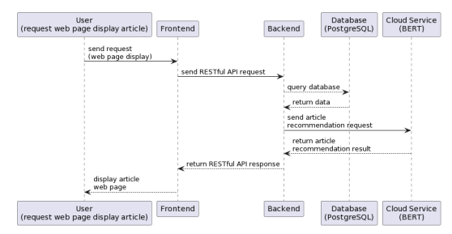
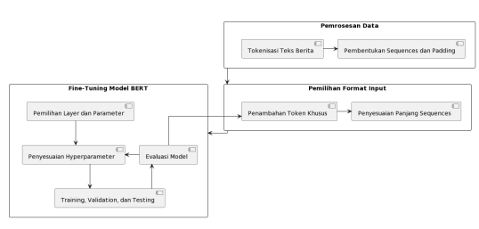
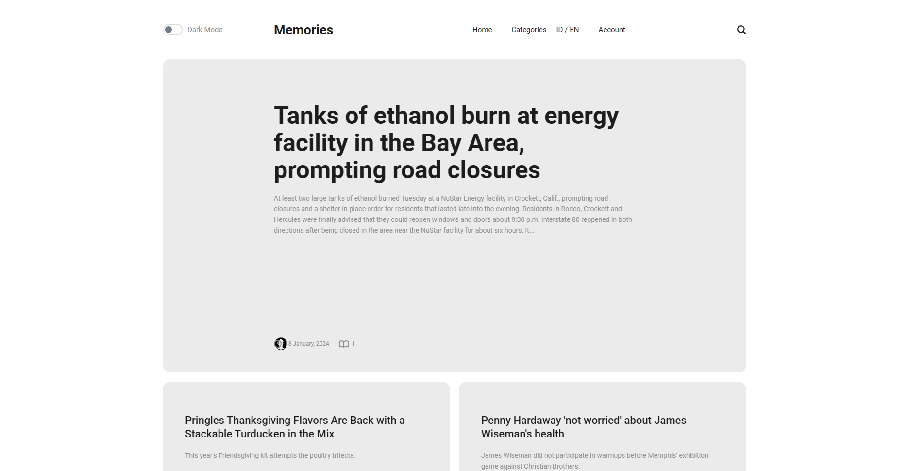
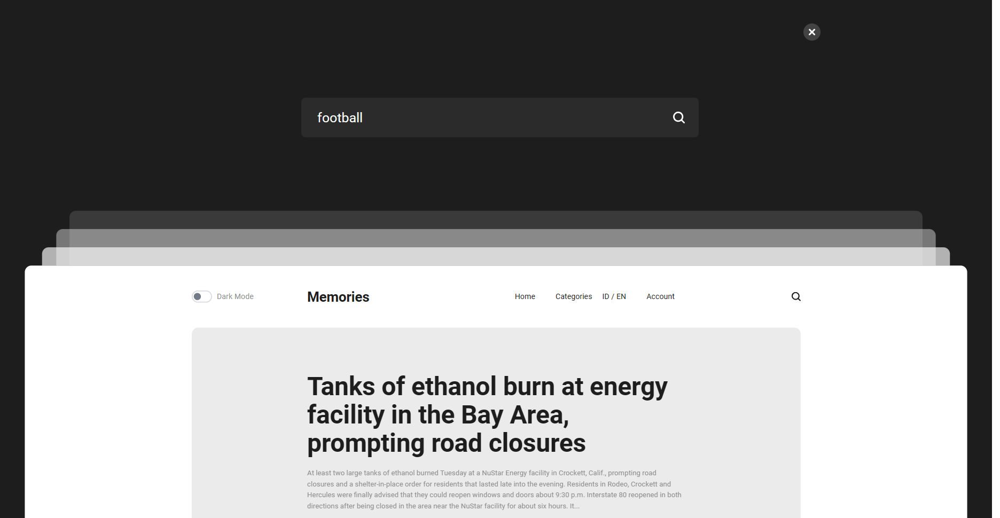

## Deskripsi Proyek: Aplikasi Berita/ Blog Pribadi dengan Implementasi Model Bahasa BERT untuk Pengembangan Sistem Rekomendasi Berita

Aplikasi ini dirancang untuk menyediakan pengalaman personalisasi dalam membaca berita atau blog. Melalui implementasi model bahasa BERT (Bidirectional Encoder Representations from Transformers), aplikasi ini dapat memberikan rekomendasi berita yang lebih akurat dan sesuai dengan preferensi pengguna. Berfokus pada Django sebagai kerangka kerja utama, aplikasi ini menyajikan antarmuka yang ramah pengguna, memungkinkan pengguna untuk menjelajahi dan membaca berita dengan mudah.

### *Teknologi yang Digunakan:*

**Django**: Digunakan sebagai kerangka kerja pengembangan web utama untuk membangun backend aplikasi.

**BERT (Bidirectional Encoder Representations from Transformers)**: Model bahasa ini digunakan untuk menganalisis dan memberikan rekomendasi berita berdasarkan pemahaman konten yang lebih baik.

**SQLite/ PostgreSQL**: Digunakan sebagai database untuk menyimpan informasi pengguna dan berita.

**HTML, CSS, JavaScript**: Digunakan untuk mengembangkan antarmuka pengguna yang menarik dan responsif.

## Permasalahan dan Tujuan Eksperimen
### Permasalahan
Dalam era informasi digital, akses cepat terhadap berita menimbulkan tantangan terkait keberagaman sumber berita dan ketepatan rekomendasi. Model bahasa BERT menawarkan solusi inovatif dalam pemrosesan bahasa alami, memahami konteks dengan lebih baik.

Aplikasi ini bertujuan mengatasi masalah ketepatan rekomendasi konten berita dengan mengintegrasikan model bahasa BERT. Pengguna akan mendapatkan rekomendasi berita yang lebih akurat sesuai preferensi mereka, mengurangi kebisingan informasi.

Meskipun banyak aplikasi rekomendasi berita, kebanyakan masih terbatas dalam memahami konteks dan preferensi pengguna. Integrasi BERT diharapkan dapat meningkatkan pemahaman terhadap konten, memberikan rekomendasi yang lebih tepat, dan menciptakan pengalaman pengguna yang lebih personal.

### Tujuan Eksperimen
Penelitian ini bertujuan untuk mencapai beberapa tujuan yang berkaitan
dengan pengembangan aplikasi rekomendasi berita berbasis model bahasa BERT:

1. Implementasi Model BERT: Mengimplementasikan model bahasa BERT
dalam sistem rekomendasi berita untuk meningkatkan pemahaman konten
dan preferensi pengguna.
2. Meningkatkan Ketepatan Rekomendasi: Meningkatkan akurasi, relevansi,
dan keberagaman rekomendasi konten berita melalui model bahasa BERT.


## Implementasi BERT

### Dataset
Dataset yang digunakan adalah MIND (MIcrosoft News
Dataset).

URL: <https://msnews.github.io/>

### MODEL BERT
Preprocessor: https://kaggle.com/models/tensorflow/bert/frameworks/TensorFlow2/variations/en-uncased-preprocess/versions/3

Encoder Model: https://www.kaggle.com/models/tensorflow/bert/frameworks/TensorFlow2/variations/bert-en-uncased-l-10-h-128-a-2/versions/2

### Peforma Model


### Tahapan Eksperimen
NOTEBOOK: [BERT-News-Recommendation.ipynb](docs/notebooks/fork-of-mind-bert.ipynb)






### Penggunaan Model

```python
def get_bert_embeddings(text):
    text_input = tf.keras.layers.Input(shape=(), dtype=tf.string)

    preprocessor = hub.KerasLayer("https://kaggle.com/models/tensorflow/bert/frameworks/TensorFlow2/variations/en-uncased-preprocess/versions/3")
    encoder_inputs = preprocessor(text_input)

    encoder = hub.KerasLayer("https://www.kaggle.com/models/tensorflow/bert/frameworks/TensorFlow2/variations/bert-en-uncased-l-10-h-128-a-2/versions/2", trainable=True)
    outputs = encoder(encoder_inputs)

    embedding_model = tf.keras.Model(text_input, outputs['pooled_output'])
    embedding_model.compile(optimizer='adam', loss='mse')

    sentences = tf.constant([text])

    emb = embedding_model(sentences).numpy()
    return emb
```

Implementasi search
```python
if 'q' in request.GET:
        form = PostSearchForm(request.GET)
        if form.is_valid():
            q = form.cleaned_data['q']
            c = form.cleaned_data['c']
        query_text = q

        posts = Post.objects.all()
        
        similarity_post_id = get_similarity(query_text)
        results = posts.filter(blog_id__in=similarity_post_id)
```

## Antarmuka Pengguna
Halaman Beranda


Halaman search


Halaman hasil search


Halaman berita


## Setup Instalasi

### Setup instructions

1. Clone the repo

    ```shell
    git clone ...
   
   cd boilerplate
    ```

2. Run in Docker ([see below](#setup-django-boilerplate-with-docker))
3. Run in Local ([see below](#setup-django-boilerplate-with-local))
4. Npm install

    ```shell
    npm install
    ```

5. Run npm build

    ```shell
    npm run build
    ```

#### Setup Django Boilerplate with Docker

- Build and run the docker container

    ```shell
    docker-compose up -d --build
    ```

- Run the migrations

    ```shell
    docker-compose exec web python manage.py migrate
    ```

- Create a superuser

    ```shell
    docker-compose exec web python manage.py createsuperuser
    ```

- Run the tests

    ```shell
    docker-compose exec web python manage.py test
    ```

- Run the server

    ```shell
    docker-compose exec web python manage.py runserver
    ```

#### Setup Django Boilerplate with Local

- Create a virtual environment

    ```shell
    python3 -m venv venv
    ```

- Activate the virtual environment

    ```shell
    source venv/bin/activate
    ```

- Install the requirements

    ```shell
    pip install -r requirements.txt
    ```

- Setup Environment Variables and change values as needed

    ```shell
    cp .env.example .env
    ```

- Run the migrations

    ```shell
    python manage.py migrate
    ```

- Create a superuser

    ```shell
    python manage.py createsuperuser
    ```

- Run the tests

    ```shell
    python manage.py test
    ```

- Run the server

    ```shell
    python manage.py runserver
    ```
  
